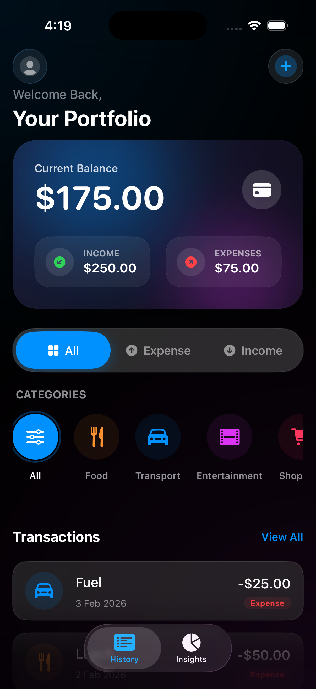
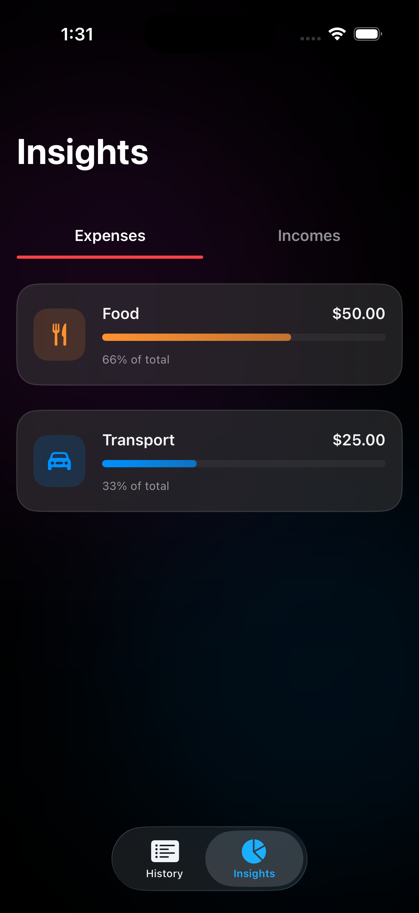
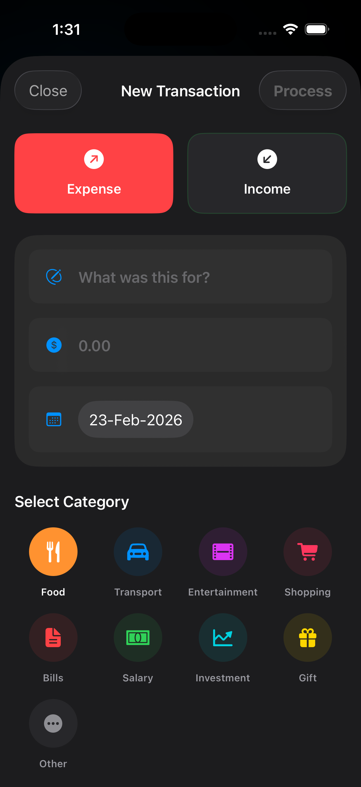
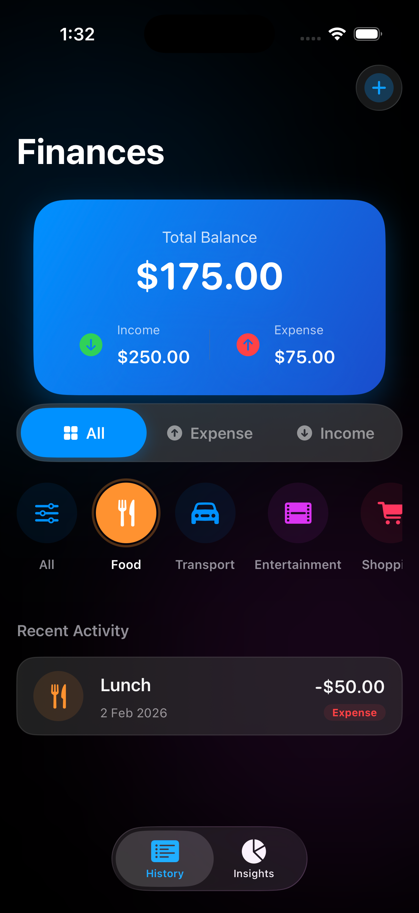

# 💎 Crystal Finance - Modern Expense & Income Tracker

**Crystal Finance** is a premium, high-performance personal finance manager built with a stunning **Glassmorphism** design. Designed for the modern user, it offers seamless tracking of income and expenses, insightful analytics, and a lightning-fast search experience—all powered by **SwiftData** and **SwiftUI**.

---

## ✨ Features

- **💎 Glassmorphism UI**: A state-of-the-art interface featuring mesh gradients, frosted glass components, and silky-smooth animations.
- **💰 Dual Tracking**: Seamlessly manage both **Income** and **Expenses** with a unified, high-contrast dashboard.
- **📊 Interactive Insights**: Visual category breakdowns for both spending habits and earning sources.
- **🔍 Real-time Search**: Instant, type-as-you-go search functionality across your entire transaction history.
- **⚡ SwiftData Persistence**: Optimized for the latest Apple technologies to ensure your data is always safe, synced, and responsive.
- **📁 Pro MVVM Architecture**: Clean, modular code structure designed for scalability and easy maintenance.
- **📱 Responsive Layout**: Fully optimized for Dark Mode and all modern iPhone display sizes.

## 🛠 Tech Stack

- **UI Framework**: SwiftUI (Declarative UI)
- **Data Layer**: SwiftData (Persistent Storage)
- **Architecture**: MVVM (Model-View-ViewModel) + Design Pattern Proxies
- **Language**: Swift 5.10+
- **Styling**: Vanilla CSS logic via SwiftUI modifiers, UltraThin Materials, and Custom Mesh Gradients.

## 📁 Project Structure

```text
Expense Tracker/
├── Models/             # Data structure & SwiftData models
├── ViewModels/         # Business logic & state management
├── Views/
│   ├── Components/     # Reusable UI elements (Glass Cards, Chips)
│   ├── Home/           # History & Dashboard logic
│   ├── Insights/       # Analytics & Visualizations
│   └── Transactions/   # Add/Edit record forms
└── ContentView.swift   # Root Application Navigation
```

## 🚀 Getting Started

### Prerequisites

- Xcode 15.0 or later
- iOS 17.0+ (for SwiftData support)

### Installation

1. Clone the repository:
   ```bash
   git clone https://github.com/asim1cva/expense_tracker_ios.git
   ```
2. Open `Expense Tracker.xcodeproj` in Xcode.
3. Ensure the target is set to a supported iOS simulator or physical device.
4. Press `Cmd + R` to Build and Run.

## 📸 Visual Preview

Check out the premium Glassmorphism design in action:

<div align="center">
  <table>
    <tr>
      <td align="center"><b>Dashboard</b></td>
      <td align="center"><b>Insights</b></td>
    </tr>
    <tr>
      <td></td>
      <td></td>
    </tr>
    <tr>
      <td align="center"><b>Add Transaction</b></td>
      <td align="center"><b>Search Experience</b></td>
    </tr>
    <tr>
      <td></td>
      <td></td>
    </tr>
  </table>
</div>

## 🤝 Contributing

Contributions are what make the open-source community such an amazing place to learn, inspire, and create. Any contributions you make are **greatly appreciated**.

1. Fork the Project
2. Create your Feature Branch (`git checkout -b feature/AmazingFeature`)
3. Commit your Changes (`git commit -m 'Add some AmazingFeature'`)
4. Push to the Branch (`git push origin feature/AmazingFeature`)
5. Open a Pull Request

## 📜 License

Distributed under the MIT License. See `LICENSE` for more information.

---

\_Created with ❤️ by Asim
